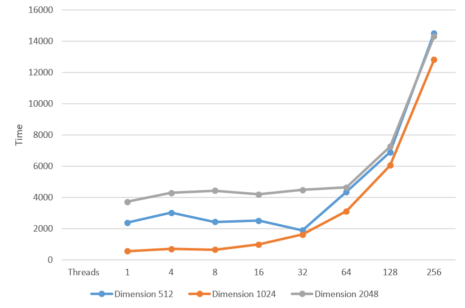
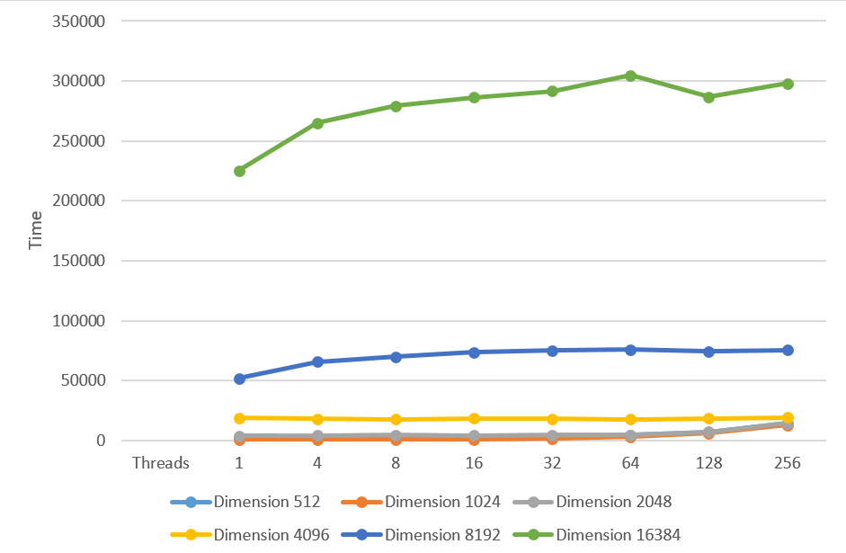
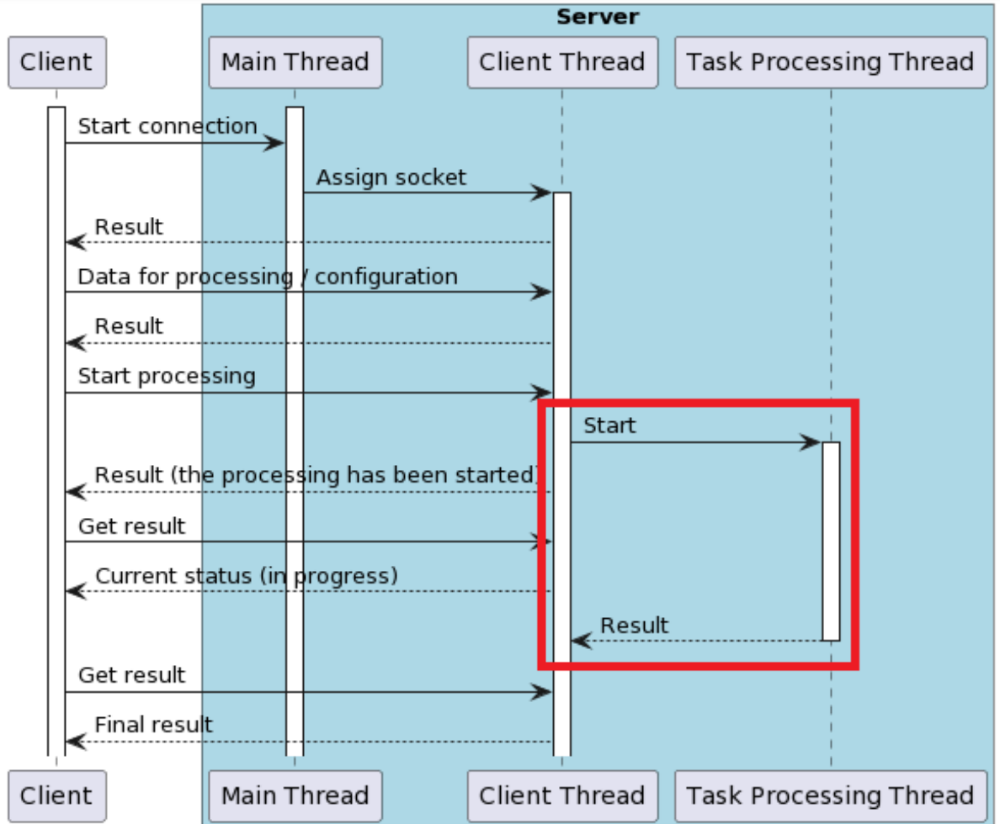
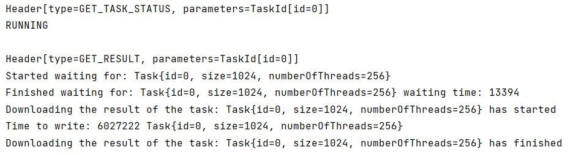

# Parallel Computing course at 'Kyiv Polytechnic Institute' 

Study of parallel computing technologies within limits one computing node and in a distributed environment.

### Built With

- Java 20 
- Maven

### Lab1. Cost of thread

- Fill the square matrix with random numbers.
- Swap even lines with odd ones (zero with the first, second with the third, etc.).
- Investigate the execution time depending on the number of threads and the size of the data

<table style="margin-block: 1rem; margin-left: 2rem;"><tr><th colspan="1" valign="bottom"></th><th colspan="6" valign="bottom">Dimension</th></tr>
<tr><td colspan="1" rowspan="2">Threads</td><td colspan="1" rowspan="2">512</td><td colspan="1" rowspan="2">1024</td><td colspan="1" rowspan="2">2048</td><td colspan="1" rowspan="2">4096</td><td colspan="1" rowspan="2">8192</td><td colspan="1" rowspan="2">16384</td></tr>
<tr></tr>
<tr><td colspan="1">1</td><td colspan="1">2377</td><td colspan="1">557</td><td colspan="1">3718</td><td colspan="1">18928</td><td colspan="1">52013</td><td colspan="1">225348</td></tr>
<tr><td colspan="1">4</td><td colspan="1">3014</td><td colspan="1">710</td><td colspan="1">4285</td><td colspan="1">18083</td><td colspan="1">65625</td><td colspan="1">265140</td></tr>
<tr><td colspan="1">8</td><td colspan="1">2427</td><td colspan="1">654</td><td colspan="1">4431</td><td colspan="1">17814</td><td colspan="1">69881</td><td colspan="1">279265</td></tr>
<tr><td colspan="1">16</td><td colspan="1">2503</td><td colspan="1">990</td><td colspan="1">4190</td><td colspan="1">18431</td><td colspan="1">73628</td><td colspan="1">286333</td></tr>
<tr><td colspan="1">32</td><td colspan="1">1902</td><td colspan="1">1622</td><td colspan="1">4482</td><td colspan="1">18225</td><td colspan="1">75165</td><td colspan="1">291647</td></tr>
<tr><td colspan="1">64</td><td colspan="1">4356</td><td colspan="1">3122</td><td colspan="1">4633</td><td colspan="1">17837</td><td colspan="1">75653</td><td colspan="1">304787</td></tr>
<tr><td colspan="1">128</td><td colspan="1">6897</td><td colspan="1">6045</td><td colspan="1">7262</td><td colspan="1">18350</td><td colspan="1">74441</td><td colspan="1">286733</td></tr>
<tr><td colspan="1">256</td><td colspan="1">14511</td><td colspan="1">12808</td><td colspan="1">14299</td><td colspan="1">19132</td><td colspan="1">75684</td><td colspan="1">297854</td></tr>
</table>

### Lab2. Thread pool.

Goal: Explore the basic synchronization primitives and their features in Java. Create own thread pool.

Task: A thread pool is served by 4 worker threads and has one execution queue. Tasks are added immediately to the end of
the execution queue. The queue of tasks is executed at 40-second intervals (the buffer is filled with tasks for 40
seconds, which are then executed), or discarded if the execution time of all tasks in the queue and a potential task to
add is more than 60 seconds. Tasks added during the execution of the task queue are discarded. The task takes a random
time between 6 and 14 seconds.

Results:

- The average time the flow is in the waiting state: 54,
- The maximum time until the queue was filled: 16,
- The minimum time until the queue was filled: 11,
- Number of rejected tasks: 68,
- The average number of rejected tasks: 17,
- Number of accepted tasks: 21,
- Average number of accepted tasks: 5.25

Preview:

### Lab3. Non-blocking algorithms

Task: Find the difference of all even elements of the array, the largest even number

- Execute tasks without using threads. Measure the time of the task.
- Execute the task according to the option using blocking synchronization primitives. Measure the task execution time,
  as well as the amount of time spent waiting for primitives to be unlocked.
- Perform the task according to the option using atomic variables and CAS operations. Measure the time of the task.

Results:

<table style="margin-block: 1rem; margin-left: 2rem;">
  <thead>
    <tr>
      <th></th>
      <th colspan="5">Length</th>
    </tr>
  </thead>
  <tbody>
    <tr>
      <td>Methods</td>
      <td>8000</td>
      <td>40k</td>
      <td>80k</td>
      <td>800k</td>
      <td>800kk</td>
    </tr>
    <tr>
      <td>Single thread</td>
      <td>0</td>
      <td>0</td>
      <td>0</td>
      <td>2</td>
      <td>2440</td>
    </tr>
    <tr>
      <td>Synchronized</td>
      <td>1</td>
      <td>3</td>
      <td>4</td>
      <td>23</td>
      <td>19290</td>
    </tr>
    <tr>
      <td>Atomic</td>
      <td>0</td>
      <td>0</td>
      <td>1</td>
      <td>15</td>
      <td>5369</td>
    </tr>
  </tbody>
</table>

### Lab4. Client-Server app

Client-Server app for basic mathematical operations on an array from lab1.

Purpose: to learn how to work over a network with several clients. Learning the TCP protocol.

Task: Create an application protocol for sending large amounts of data for server-side processing. The customer must provide info about the size & number of threads. The client can request the status of the task and receive it when it is completed.

Rust client: <a href="https://github.com/SehiiSterniichuk/client-on-rust">repository</a>

Requests:
- Post new task
- Start task
- Get task status
- Get result
- Shutdown

Preview:

### Lab5. Client-Server app. Future-Promise edition.

Task: In the client-server app from lab4, use the future-promise mechanism to work with the flow of data processing

Fig. 1. Part of the mechanism (red rectangle), which must be implemented through the future-promise

Result: The client can now request the result even if the task is still running. So, in this case, the client waited 13394 units of time

